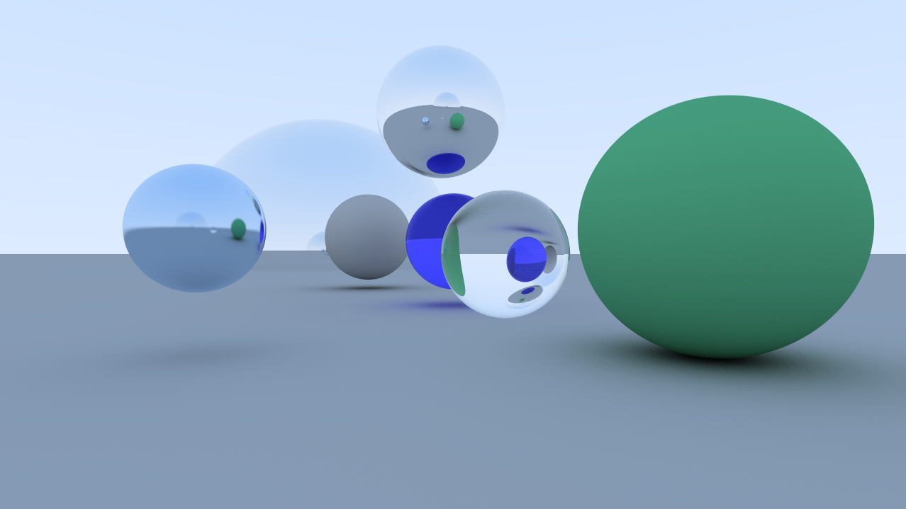

# CUDA Raytracer
A simple raytracer using CUDA and OpenGL. Raytracing is performed by a CUDA kernel,
and drawing is done with OpenGL. Adapted from ["Accelerated Ray Tracing in One Weekend in CUDA"](https://devblogs.nvidia.com/accelerated-ray-tracing-cuda/).

## Features
- Diffuse lighting
- Matte material, metallic (reflective) material, dielectric (refractive) material
- Planes and spheres

## Dependencies
- CUDA 10
- OpenGL 4
- glm
- GLFW 3
- glew
- CMake

## Building and Running
*Tested on Ubuntu 19.10*

1. Install dependencies: `nvidia-cuda-toolkit libglm-dev libglfw3-dev libglew-dev cmake`
2. `mkdir build && cd build`
3. `cmake ..`
4. `make`
5. `./main`
